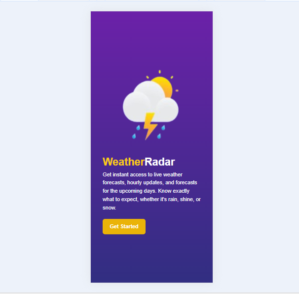

# 🌟 **Welcome to weatherRadar** 🌟

!<!-- Add a cool banner image here -->

**weatherRadar** is a single user friendly app that helps the user know about the weather and it even helps in weather forecasting. Whether you're here to check the weather, explore cool features, or just vibe with some awesome tech, you're in the right place! 🚀

---

## 🎉 **Features**

Here’s what makes this project **lit** 🔥:

### 1. **Real-Time Weather Updates** ☀️🌧️
   - Get real-time weather data for any location on Earth.
   - Displays temperature, humidity, wind speed, and more.
   - Beautiful icons to represent sunny, rainy, or cloudy days.


### 2. **Search Any City** 🌍
   - Type in a city name, and boom! You’ve got the weather.
   - After that we display suggestions which make it super easy to find your location.


### 3. **Responsive Design** 📱💻
   - Works flawlessly on desktops, tablets, and phones.
   - Weather on the go? Yes, please!

### 4. **API Magic** 🪄
   - Powered by the **OpenWeatherMap API** for accurate and reliable data.
   - API key securely stored (no peeking! 👀).

---

## 🛠️ **How It Works**

### **Tech Stack**
- **Frontend**: HTML, Tailwind CSS, JavaScript
- **API**: OpenWeatherMap
- **Tools**: node.js for the server side

## 🖼️ **Screenshots**
### Splash SCreen


### Main Page


### My Cities Page


### Search Functionality


## 🚀 **Getting Started**

### **Prerequisites**
- A modern browser (Chrome, Firefox, Safari, etc.)
- An API key from [OpenWeatherMap](https://openweathermap.org/api) (it’s free!)

### **Installation**
1. Clone the repo:
   ```bash
   git clone https://github.com/Enow-brenda/weatherRadar.git
   ```
2. Navigate to the project folder:
   ```bash
   cd your-weatherRadar
   ```
3. Add your API key:
   - Create a `API_KEY.js` file in the assets/js directory.
   - Add your OpenWeatherMap API key:
     ```API_KEY.js
     apiKey=your_api_key_here
     ```
4. Start your node.js server in your terminal:
   ```bash
   node server.js
   ```
5. Open `localhost:3000` in your browser:
   ```bash
   open index.html
   ```
6. Enjoy the weather! 🌈

---

## 🤝 **Contributing**
For now i still have many functionalities i can add to make it really cool but since time is not on my side (a one day challenge) am dealing with what i can
Love this project? Want to make it even better? Here’s how you can help:
1. Fork the repo.
2. Create a new branch:
   ```bash
   git checkout -b feature/your-feature-name
   ```
3. Commit your changes:
   ```bash
   git commit -m "Add some awesome feature"
   ```
4. Push to the branch:
   ```bash
   git push origin feature/your-feature-name
   ```
5. Open a pull request.

---

## 📜 **License**

This project is licensed under the **MIT License**. Feel free to use, modify, and share it! For more details, check out the [LICENSE](LICENSE) file.

---

## 🙏 **Acknowledgments**

- Shoutout to [OpenWeatherMap](https://openweathermap.org/) for their amazing API.
- Thanks to [Font Awesome](https://fontawesome.com/) for the cool icons.
- Big thanks to **YOU** for checking out this project! 💖

---

## 🌈 **Live Demo**

Check out the live demo here: (Still working on this)

---

## 💬 **Feedback**

Got questions, suggestions, or just want to say hi? Open an issue or reach out to me at [enowbrenda91106@gmail.com].

---

Happy coding! May your weather always be sunny and your code always bug-free! ☀️🐞

---
